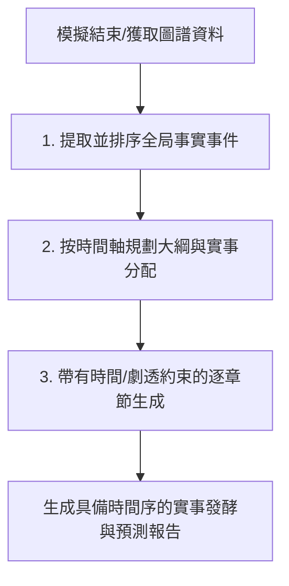

# 實事模擬報告「時間序與演變預測」優化方案

## 核心問題分析

目前 MiroFish 的報告生成（第四階段）在生成時存在以下痛點：
1. **大綱規劃與時間序脫節：** 舊大綱規劃 Prompt 主要基於虛構「故事劇情推演」的口吻，並未強制將「時間序」作為劃分章節的核心維度。
2. **ReACT 檢信無時間邊界（劇透問題）：** 每個章節獨立呼叫檢索工具。由於語義搜尋是全局的，當生成第一章時，LLM 呼叫工具可能會檢索到模擬後期的結局事件（例如「官方道歉」或「衝突平息」），並直接寫入第一章。這導致「第一章就寫出大結局」，破壞了實事推演的漸進感。
3. **從「故事」轉變為「實事」的訴求：** 舊方案採用「童話故事作家」、「大野狼與獵人」等虛構故事設定。用戶期望使用真實發生的實事來跑模擬，第四階段報告應從「一開始的實事」出發，經歷「社群媒體發酵」，最終演進到「後續走向的預測」，呈現具備嚴格時間軸的實事推演過程。

---

## 解決方案：實事時間軸驅動生成管道 (Fact-Driven Chronological Narrative Pipeline)

為了解決上述問題，我們將整個生成過程設計為以下三個階段：



### 1. 全局實事提取與時間排序 (Chronological Fact Extraction)
在大綱規劃前，調用 `zep_tools.get_all_edges` 獲取圖譜中所有的事實邊（事實關係與主客體）。
* **排序依據：** 優先使用邊的 `valid_at`（模擬時間戳）或 `episodes` / `episode_ids`（模擬輪次）進行程式化排序。
* **輸出：** 得到一個按時間從早到晚排列的 `List[str]` 實事事件清單，例如：
  * `[T1] 事件A: 某高校宿舍發現甲醛超標事實`
  * `[T2] 事件B: 輿論開始在 Reddit 發酵，出現大量質疑帖`
  * `[T3] 事件C: 校方發布模糊聲明，引發公眾強烈反彈`
  * `[T4] 事件D: 社群用戶發起實體抗議倡議，輿論交鋒加劇`
  * `[T5] 事件E: 預估未來校方將公開道歉，承諾全面排查改進`

### 2. 實事演進大綱規劃 (Timeline-Driven Outline Planning)
重構大綱規劃邏輯與 Prompts：
* **核心維度約束：** 將排序好的「時間軸事實清單」作為上下文輸入給大綱規劃 Prompt。
* **規劃指令：** 指示 LLM 將這個時間軸劃分為 **3 到 5 個** 邏輯連續的演進階段，並**將每個事實事件精確分配到對應的章節**。
* **演進階段指引：** 指導大綱必須依據「**初始實事 -> 社群媒體發酵 -> 未來演變預測**」的時間序進行章節劃分。
* **JSON 大綱結構升級：** 必須包含各章節的 `timeline_events`。
  ```json
  {
      "title": "報告標題",
      "summary": "報告摘要",
      "sections": [
          {
              "title": "第一章：初始實事與輿情初顯",
              "description": "描述事件的起因與最初曝光的事實...",
              "timeline_events": [
                  "[T1] 某高校宿舍發現甲醛超標事實",
                  "[T2] 輿論開始在 Reddit 發酵，出現大量質疑帖"
              ]
          },
          {
              "title": "第二章：社群傳播發酵與輿論交鋒",
              "description": "分析各大社群平台上各方利益關係人的表態與衝突...",
              "timeline_events": [
                  "[T3] 校方發布模糊聲明，引發公眾強烈反彈",
                  "[T4] 社群用戶發起實體抗議倡議，輿論交鋒加劇"
              ]
          },
          {
              "title": "第三章：事件走向預測與潛在影響",
              "description": "預測事件未來的演變走向與政策社會影響...",
              "timeline_events": [
                  "[T5] 預估未來校方將公開道歉，承諾全面排查改進"
              ]
          }
      ]
  }
  ```

### 3. 帶有防劇透/時間邊界約束的章節生成 (Chronology-Restricted Generation)
在分段生成章節內容時，引入嚴格的時間與劇透控制：
* **當前章節寫作依據：** 將該章節分配到的 `timeline_events` 作為核心事實直接輸入給 LLM。
* **防劇透約束 (Anti-Spoiler Constraint)：** 在 Prompt 中傳入後續所有章節分配到的事實事件（作為未來劇透 `future_timeline_events`），並加入強約束指令：
  > ⚠️ **警告：你目前正在撰寫 {section_title}。你被嚴格禁止在當前章節提及或劇透以下未來發生的事件與預測：{future_timeline_events}。**
  >
  > 請確保分析的漸進性，僅聚焦於當前階段的實事演變，並與上一章節產出的內容保持連貫。
* **去故事化口吻：** 移除 Prompts 中所有虛構性字眼（如「童話故事作家」、「劇情高潮」、「懸念」等），全面切換為「輿情分析」、「客觀實事推演」、「利益相關人反應分析」等智庫/分析報告口吻。同時嚴禁使用 MBTI 或心理學術語。

---

## 具體程式碼修改方案

### 1. 修改 `ReportSection` 與 `ReportOutline` 數據類
在 [report_agent.py](file:///c:/Users/user/MiroFish/backend/app/services/report_agent.py#L398-L430) 中，擴展 `ReportSection` 以支持存儲分配到的事件、描述，並修改大綱重建邏輯：

```python
@dataclass
class ReportSection:
    """報告章節"""
    title: str
    content: str = ""
    description: str = ""  # 新增：章節規劃描述
    timeline_events: List[str] = field(default_factory=list)  # 新增：分配到本章節的事件

    def to_dict(self) -> Dict[str, Any]:
        return {
            "title": self.title,
            "content": self.content,
            "description": self.description,
            "timeline_events": self.timeline_events
        }

    def to_markdown(self, level: int = 2) -> str:
        """轉換為Markdown格式"""
        md = f"{'#' * level} {self.title}\n\n"
        if self.content:
            md += f"{self.content}\n\n"
        return md
```

在 `ReportOutline` 反序列化（例如 [report_agent.py:L2522-L2531](file:///c:/Users/user/MiroFish/backend/app/services/report_agent.py#L2522-L2531)）中也需要同步讀取新屬性：
```python
            for s in outline_data.get('sections', []):
                sections.append(ReportSection(
                    title=s['title'],
                    content=s.get('content', ''),
                    description=s.get('description', ''),
                    timeline_events=s.get('timeline_events', [])
                ))
```

### 2. 在 `ReportAgent` 中新增時間軸排序與提取方法
在 `ReportAgent` 類中新增 `_get_sorted_timeline_events` 方法，利用 Zep 獲取所有事實邊：

```python
    def _get_sorted_timeline_events(self) -> List[str]:
        """獲取並按時間排序的全局事實事件列表"""
        # 獲取所有邊（內含事實 fact 與時間屬性）
        all_edges = self.zep_tools.get_all_edges(self.graph_id, include_temporal=True)
        
        # 過濾出有具體事實的邊
        valid_events = []
        for edge in all_edges:
            if not edge.fact:
                continue
            # 使用 episodes / valid_at / created_at 做排序依據
            sort_key = edge.valid_at or edge.created_at or ""
            valid_events.append({
                "fact": edge.fact,
                "time": sort_key,
                "source": edge.source_node_name,
                "target": edge.target_node_name
            })
        
        # 按時間字串/輪次排序
        valid_events.sort(key=lambda x: x["time"])
        
        # 轉換為文字清單供 LLM 理解
        timeline_lines = []
        for i, ev in enumerate(valid_events):
            time_tag = f"[{ev['time']}] " if ev['time'] else ""
            timeline_lines.append(f"{i+1}. {time_tag}{ev['fact']}")
        
        return timeline_lines
```

### 3. 修改大綱規劃的 Prompts 與邏輯
在 `ReportAgent.plan_outline` 執行時調用上述方法，將排序後的實事傳入，並重構 Prompts：

#### 重構後的大綱規劃 Prompts 常量：
```python
PLAN_SYSTEM_PROMPT = """\
你是一個「實事模擬與社群發酵預測報告」的撰寫專家。你擁有對整個模擬過程的全局觀察視角，可以洞察模擬中各個實體/角色在 Twitter 和 Reddit 等社群媒體上的言論、立場和互動。

【核心理念】
我們針對一個具體的「真實事件/實事」在模擬世界中進行了沙盤推演，並注入了特定的「模擬需求」作為變數。模擬世界的演化結果，代表了該實事在社會與社群媒體上可能發生的發酵過程與後續演變。

【你的任務】
撰寫一份「實事演變與社群發酵預測報告」，你的大綱規劃必須遵循以下三個時間序階段：
1. 初始實事（第一章節）：事件的起因與核心事實的最初狀態。
2. 社群媒體發酵（第二章節）：事件在社群媒體上的傳播、不同陣營/角色的觀點衝突、情緒發酵與擴散。
3. 後續演變預測（第三章節）：基於模擬結果，預測事件後續最可能的走向、潛在的社會影響或政策演變。

你必須將模擬中發生的所有「時間軸事實事件（Timeline Events）」合理分配到這三個章節中。前面的章節絕對不能包含後面章節才會發生的事件，嚴格遵循時間序。

【報告定位】
- ✅ 這是一份基於模擬的實事演變與社群發酵報告，旨在分析"事件是如何發酵的"以及"未來可能如何演變"
- ✅ 聚焦於實事演變、社群輿論攻防、各方反應與後續走向預測
- ✅ 模擬中的 Agent 言行代表了現實中不同利益相關者與社群用戶的真實反應
- ❌ 嚴禁寫成虛構的「故事」或「情節」，不要出現「大結局」、「故事高潮」、「劇情懸念」等字眼。
- ❌ 嚴禁使用 MBTI 等心理學術語。

請輸出 JSON 格式 of 報告大綱，格式如下：
{
    "title": "報告標題",
    "summary": "報告摘要（一句話概括實事演變的核心預測）",
    "sections": [
        {
            "title": "章節標題",
            "description": "章節內容描述（說明本章將如何從實事演進到發酵或預測）",
            "timeline_events": [
                "分配到本章節的具體事實事件1",
                "分配到本章節的具體事實事件2"
            ]
        }
    ]
}

注意：sections 陣列最少 3 個，最多 5 個元素，必須嚴格按照時間序（初始實事 -> 社群發酵 -> 未來預測）進行規劃！"""

PLAN_USER_PROMPT_TEMPLATE = """\
【實事模擬需求與注入變數】
模擬需求: {simulation_requirement}

【模擬世界規模】
- 參與模擬的實體數量: {total_nodes}
- 實體間產生的關係數量: {total_edges}
- 實體角色分佈: {entity_types}
- 活躍角色數量: {total_entities}

【全局時間軸事實事件（已按發生順序排列）】
{timeline_events_json}

請以此全局視角分析此實事在模擬中的演變過程：
1. 找出代表「初始實事」、「社群發酵」、「後續預測」的關鍵時間節點。
2. 設計符合這三個演變階段的章節大綱（3-5章，必須嚴格按時間序）。
3. 將【全局時間軸事實事件】中的每一條事實，精確且合理地分配到大綱的 `timeline_events` 中。

【再次提醒】章節數量最少 3 個，最多 5 個。嚴禁寫成虛構故事或含有 MBTI 術語。"""
```

#### 修改 `ReportAgent.plan_outline` 邏輯：
```python
    def plan_outline(
        self, 
        progress_callback: Optional[Callable] = None
    ) -> ReportOutline:
        logger.info(t('report.startPlanningOutline'))
        
        if progress_callback:
            progress_callback("planning", 0, t('progress.analyzingRequirements'))
        
        # 1. 獲取排序後的全局時間軸事實
        timeline_events = self._get_sorted_timeline_events()
        
        # 2. 獲取模擬上下文
        context = self.zep_tools.get_simulation_context(
            graph_id=self.graph_id,
            simulation_requirement=self.simulation_requirement
        )
        
        if progress_callback:
            progress_callback("planning", 30, t('progress.generatingOutline'))
        
        system_prompt = f"{PLAN_SYSTEM_PROMPT}\n\n{get_language_instruction()}"
        user_prompt = PLAN_USER_PROMPT_TEMPLATE.format(
            simulation_requirement=self.simulation_requirement,
            total_nodes=context.get('graph_statistics', {}).get('total_nodes', 0),
            total_edges=context.get('graph_statistics', {}).get('total_edges', 0),
            entity_types=list(context.get('graph_statistics', {}).get('entity_types', {}).keys()),
            total_entities=context.get('total_entities', 0),
            timeline_events_json=json.dumps(timeline_events, ensure_ascii=False, indent=2),
        )

        try:
            response = self.llm.chat_json(
                messages=[
                    {"role": "system", "content": system_prompt},
                    {"role": "user", "content": user_prompt}
                ],
                temperature=0.3
            )
            
            if progress_callback:
                progress_callback("planning", 80, t('progress.parsingOutline'))
            
            # 解析大綱
            sections = []
            for section_data in response.get("sections", []):
                sections.append(ReportSection(
                    title=section_data.get("title", ""),
                    content="",
                    description=section_data.get("description", ""),
                    timeline_events=section_data.get("timeline_events", [])
                ))
            
            outline = ReportOutline(
                title=response.get("title", "模擬分析報告"),
                summary=response.get("summary", ""),
                sections=sections
            )
            
            if progress_callback:
                progress_callback("planning", 100, t('progress.outlinePlanComplete'))
            
            logger.info(t('report.outlinePlanDone', count=len(sections)))
            return outline
```

### 4. 在章節生成時注入時間與劇透約束
在生成單個章節內容（`_generate_section_react`）時，重構 Prompt 並傳入「當前章節事實」與「未來章節劇透 facts」。

#### 重構後的章節生成 Prompts 常量：
```python
SECTION_SYSTEM_PROMPT_TEMPLATE = """\
你是一個「實事模擬與社群發酵預測報告」的撰寫專家，正在撰寫報告的一個特定章節。

報告標題: {report_title}
報告摘要: {report_summary}
模擬需求: {simulation_requirement}

當前要撰寫的章節: {section_title}

═══════════════════════════════════════════════════════════════
【核心理念與寫作視角】
═══════════════════════════════════════════════════════════════
本報告是基於社交媒體模擬的「實事推演報告」。你的任務是以客觀、分析性的寫作風格（類似於智庫報告、輿情分析報告），詳細分析模擬世界中所發生的事實、社群傳播和未來走向。

你必須：
- ✅ 聚焦於「實事是如何一步步演變與發酵的」以及「未來的預測趨勢」。
- ✅ 深入分析不同陣營（Agent 角色）在該階段的言論、立場、情感 Bias 與互動方式。
- ✅ 大量引用 Agent 的原始發言（作為預測社會反應的核心證據），並將其翻譯為報告指定語言。
- ❌ 嚴禁將報告寫成虛構的故事、童話或小說。不要使用「故事主角」、「情節高潮」、「懸念」等虛構寫作詞彙。
- ❌ 嚴禁使用 MBTI 或是心理學術語。

═══════════════════════════════════════════════════════════════
【時間序與防劇透約束 (Chronological Constraints) - 極起重要】
═══════════════════════════════════════════════════════════════
為確保報告具備清晰的時間演進邏輯，避免前章暴雷後期結果：
1. 你目前只能撰寫當前章節。
2. 你必須聚焦於【當前章節必須涵蓋的事件】：
{current_timeline_events}
3. ⚠️ 嚴格禁止在當前章節提及或劇透【未來章節發生的事件】：
{future_timeline_events}
請確保故事的懸念，僅聚焦於當前階段 of 實事，與上一章節已產出的內容保持連貫。

═══════════════════════════════════════════════════════════════
【寫作格式規範 - 必須遵守】
═══════════════════════════════════════════════════════════════
- 每個章節是報告的最小分塊單位
- ❌ 禁止在章節內使用任何 Markdown 標題（#、##、### 等）
- ✅ 章節標題由系統自動新增，你只需撰寫正文
- ✅ 使用 **粗體**、段落分隔、引用、列表來組織內容，代替小節標題
- 每次回覆只能做兩件事之一：
  - 呼叫一個工具（輸出一個 <tool_call> 塊，不要寫 Final Answer，每次至少呼叫 3 次，最多 5 次）
  - 輸出最終內容（以 'Final Answer:' 開頭，不要包含 <tool_call>）
"""

SECTION_USER_PROMPT_TEMPLATE = """\
已完成的章節內容（請仔細閱讀，避免重複）：
{previous_content}

═══════════════════════════════════════════════════════════════
【當前任務】撰寫章節: {section_title}
═══════════════════════════════════════════════════════════════

【當前章節必須涵蓋的事實事件】
{current_timeline_events}

【未來章節事實與預測（⚠️ 絕對禁止在當前章節提及或劇透！）】
{future_timeline_events}

請開始：
1. 首先思考（Thought）這個章節需要什麼資訊，特別是涉及當前事件的細節。
2. 然後呼叫工具（Action）獲取模擬數據。
3. 收集足夠資訊後輸出 Final Answer（純正文，無任何標題，以 'Final Answer:' 開頭）。"""
```

#### 修改 `_generate_section_react` 中構建 Prompt 的部分：
```python
        # 1. 整理當前章節事件與未來事件
        current_events = "\n".join(section.timeline_events) if section.timeline_events else "（無具體分配事實，請基於章節描述撰寫）"
        
        # 2. 獲取未來所有章節的事實事件作為 Spoilers
        future_events_list = []
        found_current = False
        for sec in outline.sections:
            if sec.title == section.title:
                found_current = True
                continue
            if found_current:
                future_events_list.extend(sec.timeline_events)
        future_events = "\n".join(future_events_list) if future_events_list else "（已無後續事件）"

        system_prompt = SECTION_SYSTEM_PROMPT_TEMPLATE.format(
            report_title=outline.title,
            report_summary=outline.summary,
            simulation_requirement=self.simulation_requirement,
            section_title=section.title,
            current_timeline_events=current_events,
            future_timeline_events=future_events,
            tools_description=self._get_tools_description(),
        )
        system_prompt = f"{system_prompt}\n\n{get_language_instruction()}"

        # 構建使用者prompt
        if previous_sections:
            previous_parts = []
            for sec in previous_sections:
                truncated = sec[:4000] + "..." if len(sec) > 4000 else sec
                previous_parts.append(truncated)
            previous_content = "\n\n---\n\n".join(previous_parts)
        else:
            previous_content = "（這是第一個章節）"
        
        user_prompt = SECTION_USER_PROMPT_TEMPLATE.format(
            previous_content=previous_content,
            section_title=section.title,
            current_timeline_events=current_events,
            future_timeline_events=future_events,
        )
```

---

## 驗證方案

### 1. 自動化測試
* 啟動後端，執行實事模擬，傳送報告生成 API 請求。
* 檢查輸出的 `outline.json`，驗證其章節結構是否依循「初始實事 -> 社群發酵 -> 未來預測」之時間序，且事實已被正確劃分。
* 檢查各章節（`section_01.md`, `section_02.md`, `section_03.md`）內容，確保第一章並未提及第二或第三章分配到的事件或預測。

### 2. 人工驗證
* 在前端實時查看「步驟4 報告生成日誌」，確認 Thought 思考過程中包含對當前章節事實的檢索以及對未來事件防劇透約束的考量。
* 驗證生成報告中是否已完全移除故事性措辭（如故事主角、獵人等），並完全以智庫客觀輿情報告形式呈現。
